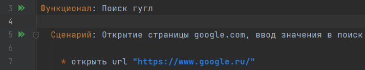
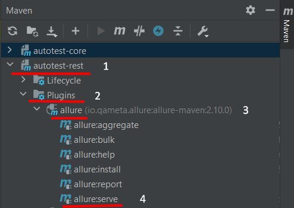
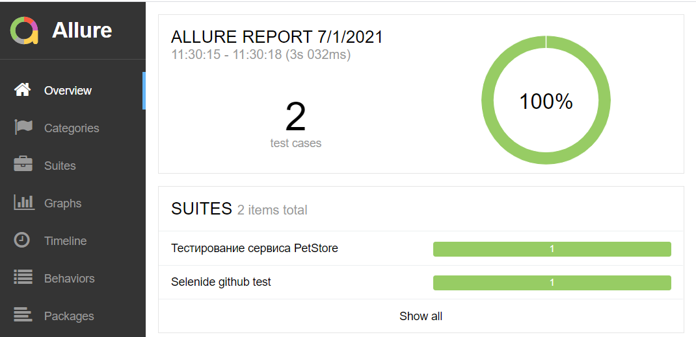
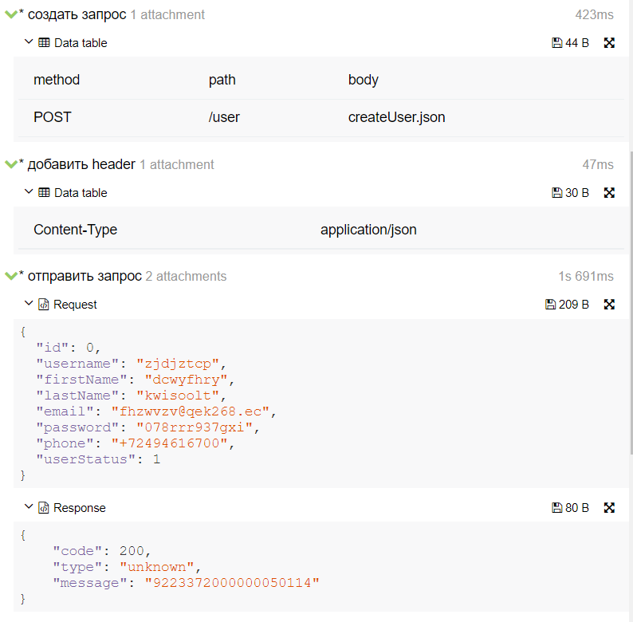

## Шаблон Фреймворка  для запуска автотестов
BDD фреймворк для автотестов на Java, использующий:
- [Selenide](https://ru.selenide.org) для тестирования Web UI
- [Cucumber](https://cucumber.io) для написания сценариев в стиле BDD
- [REST assured](https://rest-assured.io) для тестирования REST API

## Как начать писать WEB автотесты
## 1.  Page Objects
В модуле ***autotest-web*** в директории ***src/main/java/pages*** находятся классы ***PageObjects***<br/>
**1.1** Каждый ***PageObject*** должен наследоваться от класса ***WebPage***<br/>
**1.2** Над классом необходимо проставить аннотацию *@Name(**value** = "<имя страницы>")*<br/>
Пример:<br/>
```java
@Name(value = "Главная страница приложения")
public class MainPage extends WebPage {

    @Name("Слайдер")
    private SelenideElement uuid = $(".slick-track");
}
```
## 2. Степы
**2.1** В классе со степами необходимо наследовать от класса AbstractWebSteps и конструктор класса следующим образом:<br/>
```java
public class WebActionSteps extends AbstractWebSteps {

    public WebActionSteps(PageManager pageManager) {
        super(pageManager);
    }
    // steps
}
```
* ссылка ***pageManager*** хранит в себе инициализированный контекст текущей страницы, с помощью которой можно достать элемент через ***value*** аннотации  ***@Name*** элемента <br/>
* При компиляции ссылка ***pageManager*** проинициализируется автоматически путем Dependency Injection через PicoContainer <br/>
* Более подробно о подходе можно ознакомиться по ссылке [Cucumber PicoContainer](https://cucumber.io/docs/cucumber/state/) <br/>


**2.2** Пример инициализации страницы:<br/>
Для того, чтобы получить доступ к элементу, нам необходимо перед этим проинициализировать ***PageObject*** <br/>
**pageName** - это value аннотации **Name** класса ***PageObject*** - в нашем примере *"Google"*
```java
public void setPage(String pageName) {
        WebPage page = getPage(pageName);
        pageManager.setCurrentPage(page);
}
```
**2.3** Теперь страница проинициализирована и получить доступ к элементам можно по его имени ***(value)***<br/>
```java
@Если("кликнуть на элемент {string}")
public void clickOnElement(String elementName) {
    SelenideElement element = pageManager
                        .getCurrentPage()
                        .getElement(elementName);
    element.shouldBe(visible).click();
}
```

**2.4** Осуществление мягких проверок (SoftAssert)<br/>
В конфигурации Selenide есть параметр Configuration.assertionMode, который не отрабатывает должным образом в связке с Cucumber и потому его использование в проекте не допускается.
Для осуществления мягких проверок следует использовать класс ru.lanit.at.assertion.AssertsManager. 
Пример использования (Проверка утверждений у SelenideElement) 

```java
public static void elementContainsText(SelenideElement element, String text) {
        element.execute(Commands.checkSoft(Condition.text(text), Duration.ofSeconds(10)));
}
```

**2.5** Расширение и изменения методов SelenideElement с помощью механизма SPI <br/>
Если нужно изменить поведение стандартных методов SelenideElement,  это можно сделать след образом.
В классе ru.lanit.at.utils.selenide.extensions.CustomCommands, необходимо релизовать свою логику, например код ниже, будет перед осуществлением клика, прикладывать скриншот элемента, на который будет происходить нажатие.    
```java
public <T> T execute(Object proxy, WebElementSource webElementSource, String methodName, @Nullable Object[] args) throws IOException {
        if(methodName.equals("click")){
            addAllureScreenshootElement((SelenideElement)proxy);
        }
        return super.execute(proxy, webElementSource, methodName, args);
    }

    private void addAllureScreenshootElement(SelenideElement selenideElement){
        AllureHelper.attachScreenShot("Клик на элементе ", selenideElement.getScreenshotAs(OutputType.BYTES));
    }
```
Изменения логики формирования Page объектов, осуществляется в классе ru.lanit.at.utils.selenide.extensions.CustomSelenidePageFactory. С помощью этого класса можно расширить/изменить логику инициализации элементов. 

## 3. Тесты

```gherkin
#language:ru
Функционал: Поиск гугл
  Сценарий: Открытие страницы google.com, ввод значения в поиск

    * открыть браузер
    * инициализация страницы "Google"
    * ввести в поле "поле поиска" значение "Погода в Москве"
    * на странице имеется элемент "результаты поиска"
    * кликнуть на элемент "кнопка поиска"
    * инициализация страницы "страница результатов поиска"
    * на странице присутствует текст "Погода в Москве"
```
* Шаг 1 - открытие веб страницы
* Шаг 2 - инициализация ***PageObject*** через его ***value*** аннотации ***@Name***
* Шаг 3 - как в примере **2.3** получаем текущий элемент по его ***value*** аннотации ***@Name*** и производим действия/проверки

## 4. Настройки
В директории ***autotest-web/src/test/resources/config*** имеются примеры *config-файлов* для разных браузеров и общих настроек запуска.

configuration.properties 
```properties
stand= названия стенда для тестирования  в классе (ru.lanit.at.utils.Stand) содержатся адреса стендов
screen_after_step=false - необходимость прикреплять скриншот к каждому шагу
baseUrl=https://petstore.swagger.io/v2/ - базовый url для апи запросов
```

chrome.properties 
```properties
webdriver.browser.size=1920x1080 - разрешение браузера
webdriver.browser.name=chrome  - название браузера
webdriver.timeoutSeconds=4  - таймаут ожидания состояния веб-элементов
polling.timeoutMs=200  - периодичность опроса веб-элемента
webdriver.version=91.0  - версия веб-драйвера

```
Так же с помощью одноименных переменных окружения можно переопределить данные настройки<br>
Драйвера скачиваются с помощью **WebDriverManager**, учитывайте это если находитесь в закрытом контуре

## Как начать писать API тесты
### Принцип написания тестов похож на подход создания и отправки запроса в Postman
*Шаг 1. Конфигурируем запрос с помощью шага*
```gherkin
* создать запрос  
  | method | path | body | url |
```
Если какой то из столбцов не указан в данном шаге, то он не учитывается в запросе
Например:
```gherkin
* создать запрос  
  | method | path  | body            |  
  | POST   | /user | createUser.json |
ИЛИ
* создать запрос  
  | method | path  |      body        |  
  | POST   | /user | {<тело запроса>} |
ИЛИ
* создать запрос  
  | method |                  url                           |   
  | GET    | https://petstore.swagger.io/v2/user/<username> |
```
* Можно указать ***basePath*** через одноименную системную переменную или в файле конфигурации ***configuration.properties***. Тогда вместо столбца url можно указывать просто path. И наоборот, если указать столбец url с полным url хоста и path то basePath не учитывается, даже если указан с системных переменных.
* Тело запроса - в качестве тела можно передать в таблицу, как просто текст, так и название файла ***json***, которое будет лежать по пути ***autotest-rest/src/test/resources/json***

*Шаг 2. Добавление Headers и Query*
```gherkin
* добавить header  
  | Content-Type | application/json |
* добавить query параметры  
  | city | Moscow |
```
*Шаг 3. Отправка запроса*
```gherkin
* отправить запрос
```
*Шаг 4. Проверка ответа*
```gherkin
* статус код 200
```
Если необходимо проверить тело ответа, то данные можно вытащить с помощью jsonpath. Значение сохранится в переменную из столбца 1<br/>
```gherkin
* извлечь данные  
  | user_id | $.message |
```
Проверить извлеченные данные можно с помощью шага:
```gherkin
* сравнить значения  
| ${user_id} | != | null |
ИЛИ
| ${user_id} | == | 1234567890 |
ИЛИ
| ${user_id} | > | 0 |
ИЛИ
| ${user_id} | < | 100 |
ИЛИ
| ${user_id} | содержит | qwerty123 |
```
### Иная информация.
С помощью следующего шага можно сгенерить переменные для последующего использования в тесте
```gherkin
* сгенерировать переменные
   | id         | 0                 |
   | username   | EEEEEEEE          |
   | firstName  | EEEEEEEE          |
   | lastName   | EEEEEEEE          |
   | email      | EEEEEEE@EEEDDD.EE |
   | password   | DDDEEEDDDEEE      |
```
**R** - случайная русская буква<br/>
**E** - случайная английская буква<br/>
**D** - случайное число<br/>
Другие символы в строке игнорируются и остаются неизменяемыми
Сгенерированные значения хранятся в контексте теста. Их можно подставлять в запросы, тела запросов. Достать их можно используя синтаксис ***${username}***<br/>

### Запуск тестов через консоль

```java 
mvn clean test  -Ddataproviderthreadcount=4  -Dscreen_after_step=false -Dtags="@authentication"
 ``` 
* ***-Ddataproviderthreadcount=4*** - кол-во поток выполнения, значение по умолчанию 1 поток (Изменение дефолтного кол-ва поток производится в файле src\test\resources\suite.xml)

* ***-Dscreen_after_step=false***  - Автоматическое снятие скриншотов после каждого шага. Дефолтное значение =false (Изменение дефолтного значения производится в файле src\test\resources\config\configuration.properties)

* ***-Dtags="@authentication"***  - Выбор тестов с определенным тегом. Дефолтное значение отсутствует, т.е. если в запуске не указывать данный параметр то, будет запущены все фичи файлы.

>Тажке в командную строку можно передать любой параметр из файлов *.properties
>Для добавление нового параметра, его нужно будет прописать в соответствующем .properties  файле и добавить соответствущий полю getter в java классе.    

#### Для запуска с дефолтными параметрами используется команда. 
```java 
mvn clean test 
 ```


Так же запустить тесты можно через плагин Cucumber (предварительно установив его в Idea), для этого необходимо открыть любой feature-файл, и кликнуть по зеленой стрелке рядом со стройкой **Функционал** или **Сценарий**<br/>


### Генерация отчета
По итогу прогонов можно сгенерить _Allure отчет_, для этого необходимо в Intellij Idea кликнуть на строку **Maven** в правом верхнем углу IDE и следовать инструкции по пунктам ниже:<br/>
В **п.1** необходимо выбрать тот модуль, в котором запускались тесты.<br/>
<br/>
**По итогу сформируется Html страница с отчетом.**<br/>
<br/>
**В отчете можно провалиться в каждый шаг и посмотреть информацию по нему**<br/>
<br/>

где 
* Зеленым цветом отмечены - успешно прошедшие тесты
* Желтым цветом отмечены - тесты в которых есть неблокирующие дефекты
* Серым цветом отмечены - тесты который были пропущены 
* Красным цветом отмечены - тесты с блокирующим дефектом

**Шаги с неблокирующими дефекты** помечаются в отчете желтым цветом. По окончании теста отображается информация о всех подобных дефектах.  
